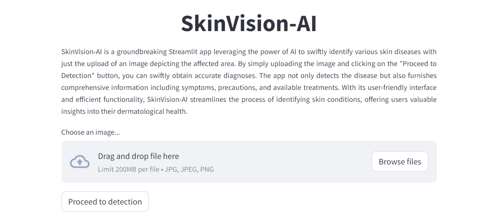

# SkinVision-AI

Welcome to the SkinVision-AI Project repository! This project utilizes the Google Gemini model for skin disease detection using AI. Users can upload images of affected areas and receive information about the disease, including symptoms, precautions, and remedies, by clicking the "Proceed to detection" button.

# Technologies Used

- Python
- Streamlit
- Google API Key

# Deployment
The project is deployed using Streamlit Sharing. You can access the deployed application at the following URL:

[SkinVision-AI Project]()

# License
This project is licensed under the MIT License. See the LICENSE file for details.

# How to Use
To run the SkinVision-AI app locally:

1. Clone this repository to your local machine.
2. Install the required Python libraries by running:
    ```
    pip install -r requirements.txt
    ```
3. Set up your Google API Key as an environment variable named `GOOGLE_API_KEY`.
4. Run the app using the following command:
    ```
    streamlit run app.py
    ```
5. Once the app is running, visit http://localhost:8501 in your web browser.
6. Upload an image of the affected area.
7. Click the "Proceed to detection" button.
8. Receive information about the disease, including symptoms, precautions, and remedies.

# Glance of project



# Contributions
Contributions to the SkinVision-AI Project are welcome! If you'd like to contribute, please fork the repository and create a pull request with your changes.

For inquiries and contributions, feel free to contact:
- 📧 [Email](mailto:vbkate9@gmail.com)
- 🔗 [LinkedIn](https://www.linkedin.com/in/virendrakate/)

Thank you for your interest in the SkinVision-AI Project! If you have any questions or concerns, feel free to contact us.
